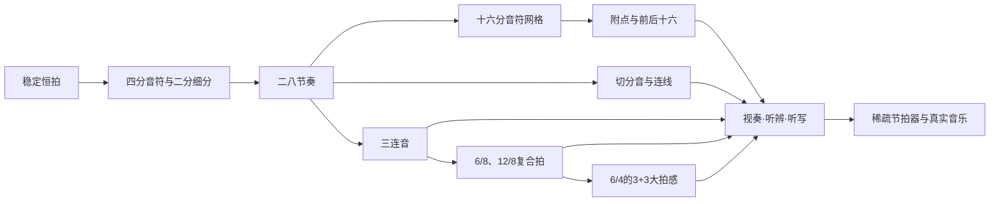

# 节奏型系统学习与实践报告

## 执行摘要

本报告以“**能准确识别、读出、听辨并演奏常见节奏型**”为最终目标，默认以钢琴、拍手/敲击和节拍器为主要练习媒介，不限定具体乐器。最有效的学习顺序不是逐个死记“节奏图形”，而是建立一套稳定的时间感知系统：**恒定脉冲 → 拍内细分 → 音值/休止 → 拍号与强弱关系 → 节奏型 → 听辨/听写 → 乐器演奏 → 减少节拍器提示**。伯克利音乐学院的节奏课程同样把 internal pulse、subdivision、listening、performance、dictation 和 notation 作为同一训练链条，而非互相分离的知识点。citeturn15view3

首先需要澄清两个中文术语：

**“二八节奏型”通常不是“2/8 拍”。** 在中文视唱练耳教学中，“二八节奏”通常指“**两个八分音符均分一个单位拍**”。EarMaster 中文教学资料明确把“二八节奏”解释为两个八分音符均分一拍，并与“四个十六分音符均分一拍”“一拍三等分的三连音”并列；北京现代音乐研修学院也有专门以“二八节奏的连线节奏”为主题的基础节奏公开课。citeturn15view0turn14search1

**“四四拍、四二拍、四六拍”是中文常见的拍号读法。** “四四拍”即 4/4，“四二拍”即 2/4，“四六拍”即 6/4。对 6/4 尤其要避免只机械地数“六拍”：在现代节拍分析中，常规 6/4 属于**复合二拍子**，可感受为两大拍，每大拍含三个四分音符，即 **3+3**；对应的大拍单位是附点二分音符。6/8 则同样是复合二拍子，但细分单位换成八分音符，大拍单位是附点四分音符。citeturn16view1turn16view2

本报告建议把学习分成三个阶段。初级先稳定 2/4、4/4 中的四分、八分、“二八”、简单附点和基本三连音；中级加入十六分网格、切分、连线、6/8、12/8、6/4；高级则进入**弱拍/反拍节拍器、稀疏节拍器、真实音乐听写、混合节奏与连续视奏**。练习中要贯彻“先唱/数，再拍，再弹”的顺序。人教社音乐教学资源也明确采用先感知、唱读节奏，再通过拍击表现的方法，以减少演奏技术本身对节奏学习的干扰。citeturn14search0

最值得作为主干资源的是：[中央音乐学院《中国大学MOOC：音乐奥秘解码——轻松学乐理》](https://www.icourse163.org/course/CCOM-1003681001)、[四川音乐学院《中国大学MOOC：乐理》](https://www.icourse163.org/learn/SCCM-1461521175)、[Open Music Theory](https://viva.pressbooks.pub/openmusictheory/)、[EarMaster](https://www.earmaster.com/)、[teoria.com](https://www.teoria.com/en/help/exercises/rr.php)、[MuseScore Studio](https://musescore.org/) 和 [Groove Scribe](https://groovescribe.com/)。其中中央音乐学院课程面向零基础，且该线上课程入选首批国家级一流本科课程；四川音乐学院课程则系统覆盖记谱法、节奏节拍以及分程度习题。citeturn13view5turn14search5turn15view7

下图概括整套学习路线：



这一路线的核心思想不是“先把理论全部学完再练”，而是让**符号、声音、动作和内部脉冲形成同一个概念**。这与伯克利课程把节奏从听觉、动作、演奏、听写和记谱同时训练的设计相吻合。citeturn15view3

## 学习框架与必备基础

真正决定节奏能力的并不是能否说出“这是八分音符”，而是能否在没有持续外部提示的情况下，维持拍点、准确细分，并把看到或听到的节奏还原出来。因此建议把基础能力分成下表几个层级。

| 必须掌握的概念/技能 | 要达到的理解 | 实践标准 |
|---|---|---|
| **音值与比例** | 全、二分、四分、八分、十六分之间的倍比；休止符具有同样的时值关系 | 不看乐器即可口数并拍出常见组合 |
| **恒拍 / pulse** | 节拍是连续稳定的时间参照，节奏是在参照之上的长短组合 | 即使出现休止或长音，脚/身体内部拍点不消失 |
| **拍号** | 4/4、2/4 等简单拍与 6/8、12/8、6/4 等复合拍的基本结构不同 | 能先判断“大拍在哪里”，再读音符 |
| **强弱拍与分组** | 4/4 常感受为强—弱—次强—弱；复合拍要先形成大拍，再感受内部三等分 | 重音不能破坏速度 |
| **拍内细分** | 二分细分：`1 &`；四分细分：`1 e & a`；三分细分：`1-la-li` 等 | 在同一 BPM 下自由切换二分、三分、四分 |
| **附点** | 附点增加原音符自身时值的一半 | 能把附点节奏还原到最小细分网格 |
| **连线** | 同音连线将时值相加；跨强拍连线常形成切分感 | “看见强拍但不重新发音” |
| **切分音** | 弱位发音并延续/重音，使原有强弱关系发生位移 | 脚保持拍点，手能稳定打反拍 |
| **三连音** | 在简单拍中将原本二分的拍临时三等分，并以数字 3 标示 | 不把三连音弹成附点节奏 |
| **复合拍** | 每一大拍本身三等分；6/8 是两大拍，12/8 是四大拍，常规 6/4 是两大拍 | 能同时感觉“大拍”与三等分内部脉冲 |
| **节奏记谱分组** | 连梁、拍内分组和跨拍连线要帮助读者看见节拍结构 | 看到谱面能迅速定位每一拍 |
| **节拍器使用** | 节拍器不是“带着你走”，而是检查你自己的内部时间 | 能从细分点击逐渐退化到一拍一次、两拍一次甚至一小节一次 |
| **节奏听辨/听写** | 从声音识别拍号、拍点、细分、重音、休止及节奏组合 | 可将短节奏从声音转成记谱，再回放验证 |

一个尤其重要的概念是：**拍号的上下数字不能在所有情况下简单理解成“上面是拍数、下面是什么音符一拍”。** 对 4/4、2/4 等简单拍，这种入门解释通常够用；但在 6/8、12/8、6/4 等复合拍里，更严谨的理解是上方数字表示一小节包含多少个“细分单位”，而真正感知的大拍每拍包含三个细分。例如 6/8 有六个八分细分，却通常感觉成两个附点四分音符大拍；6/4 有六个四分细分，却通常感觉成两个附点二分音符大拍。citeturn16view2

因此，学习 6/8 时不应长期数成六个彼此等权的“1-2-3-4-5-6”；初期可以用六个细分校准，但最终必须收束成：

```text
6/8：

细分：  1   la  li | 2   la  li
音值：  ♪   ♪   ♪  | ♪   ♪   ♪
大拍：  >          | >
        第一大拍     第二大拍
```

Open Music Theory 对复合拍的定义正是“每一拍分成三个部分”，并将 6/8、6/4 归为 compound duple，将 12/8 归为 compound quadruple。citeturn16view1turn16view2

**强烈建议建立三套口数体系**，而不要只依赖“哒哒哒”：

```text
二等分：1  &  2  &  3  &  4  &
四等分：1  e  &  a  2  e  &  a ...
三等分：1  la li  2  la li ...
```

口数系统的名称可以替换，真正重要的是**每一个音节必须固定对应拍内的一个位置**。Open Music Theory 也特别说明，不同教师可能使用不同的复合拍计数音节，因此没有必要拘泥于某一套英文口令。citeturn16view1

## 重点节奏型的定义、记谱与练法

以下 BPM 均是**本报告建议的训练范围，而非统一教学标准**。原则是：宁可慢到能精确理解拍内位置，也不要用速度掩盖错误。每个节奏先连续做对，再逐步升速。

**二八节奏型**

定义上，二八节奏就是**一个单位拍由两个等长八分音符构成**。EarMaster 中文资料明确将其称为“两个八分音符均分一拍”。citeturn15view0

在 4/4 中可写作：

```text
拍号：  4/4
谱面： | ♪ ♪   ♪ ♪   ♪ ♪   ♪ ♪ |
口数： | 1 &   2 &   3 &   4 & |
拍点： | >     >     >     >   |
```

简谱思想可表示为：

```text
每个数字为八分音符：
| 1 1  1 1  1 1  1 1 |
  1 &  2 &  3 &  4 &
```

逐步练法应从“拍”向“细分”建立，而不是直接敲八个音。先用脚踩四分拍，同时口念 `1-&-2-&-3-&-4-&`；然后只在 `1 2 3 4` 拍手，再改成八个位置全部拍手；接着交替一小节四分音符、一小节二八；最后用钢琴单音重复、左右手交替或随机加入八分休止符。北京现代音乐研修学院对二八节奏公开课采用身体拍击、节奏接龙、听觉分析等多种训练形式，说明这类基础节奏很适合脱离乐器先建立身体节奏感。citeturn14search1

建议节拍器先设 **♩=50–70 BPM**，打开八分音符细分；稳定后关闭细分，只留四分拍，再升至 **70–100 BPM**。最终测试是在节拍器只给 2、4 拍或隔拍点击时仍能保持八分音符均匀。

可直接使用：[EarMaster 节奏训练](https://www.earmaster.com/)、[teoria.com Rhythmic Reading](https://www.teoria.com/en/help/exercises/rr.php)、[Groove Scribe](https://groovescribe.com/)；Groove Scribe 可直接制作八分、十六分和三连音节奏，试听并下载 MIDI。citeturn13view11

**四四拍与四六拍**

4/4 是最适合建立简单拍框架的拍号之一。训练时不要只做到“一小节四下”，而要感受到结构：

```text
4/4：
计数： | 1   2   3   4 |
力度： | 强  弱  次强  弱 |
```

之后再在每拍内部二分或四分：

```text
| 1 & 2 & 3 & 4 & |
| 1 e & a 2 e & a ... |
```

6/4 则需要特别处理。按常规复合拍分析，它是**复合二拍子**：

```text
6/4：

四分细分： | ♩ ♩ ♩ | ♩ ♩ ♩ |
位置：     | 1 2 3 | 4 5 6 |
大拍：     |   一   |   二   |
重心：     |   >   |   >   |

更好的内部口数：
| 1  la li | 2  la li |
```

Open Music Theory 将 6/4 与 6/8 同列为复合二拍子；其区别在于 6/4 中每个大拍由三个四分音符构成，因此大拍单位为附点二分音符，而 6/8 每个大拍由三个八分音符组成，大拍单位为附点四分音符。citeturn16view1

练 4/4 时，先 **♩=60–80** 全拍点击，一手打四分、一手弹二八；随后加入不同的八分/十六分组合，并升至 **80–100 BPM**。练 6/4 时，第一阶段可让节拍器明确给出六个四分细分，建议 **♩=60–90**；第二阶段不再依赖六个点击，而要用“3+3”身体摆动或指挥动作形成两大拍；第三阶段让节拍器仅给大拍，实际 BPM 按音乐速度和所用 App 的拍号逻辑设置。

需要注意，**真实音乐中最终应以实际重音、乐句和伴奏型判断分组**，不要仅凭“6”就机械认定所有音乐的听感完全相同；这里的 3+3 是常规 6/4 教学模型。

理论参考首选：[Open Music Theory：Compound Meter and Time Signatures](https://viva.pressbooks.pub/openmusictheory/chapter/compound-meters-and-time-signatures/)。

**三连音**

三连音属于连音符（tuplet）：在简单拍中把一个拍、一个细分单位或多个拍的时值**等分成三个部分**，谱面通常用数字 **3** 标明。citeturn16view3

最典型的一拍八分三连音：

```text
普通八分：     ♪    ♪
               1    &

八分三连音：   ♪   ♪   ♪
               └──3──┘
               1  trip let
或             1  la  li
```

最好的入门方法不是马上在琴上弹，而是保持四分脉冲，用一句稳定的三个等音节覆盖每一拍。确认“三个位置完全等距”后，再做：

```text
一拍二等分 → 一拍三等分 → 一拍二等分
♪ ♪       → ♪ ♪ ♪₃    → ♪ ♪
```

这是区分普通八分和三连音的关键练习。第二步把每组三连音重音轮换到第一、第二、第三个音：

```text
> . . | > . .
. > . | . > .
. . > | . . >
```

这样可以防止只会“背一串三连音”，却没有真正掌握三个拍内位置。

建议先用 **♩=45–65 BPM + 三连音细分点击**；稳定后关闭三连音细分，只保留四分拍，升至 **60–90 BPM**。高级测试是把节拍器设为每两拍一次，同时连续切换四分、二八、三连音、十六分而不改变大拍速度。

理论和在线示例可直接用：[Open Music Theory：Other Rhythmic Essentials](https://viva.pressbooks.pub/openmusictheory/chapter/other-rhythmic-essentials/)、[EarMaster](https://www.earmaster.com/) 以及 [Groove Scribe](https://groovescribe.com/)。Open Music Theory 不仅解释三连音，还提供谱例和听觉练习入口。citeturn16view3

**切分音**

切分的本质不是“长短长”这个图形，而是**重音或音的延续跨过原本的强拍位置，使弱位获得结构性强调**。Open Music Theory 将 syncopation 定义为 off-beat rhythmic accents，并说明连线、附点、休止和力度重音都可以形成切分。citeturn16view4

中文教学中常见的“两拍小切分”可以理解为：

```text
八分 + 四分 + 八分

网格： | 1   &   2   & |
发音： | X   X       X |
时值： | ♪   ♩       ♪ |
            └持续跨过第2拍
```

关键不是“第二个音比较长”，而是中间的四分音符**从第一拍的后半拍开始，跨过第二拍的强位置却不重新发音**。

逐步练习法：

先让脚持续踩 `1-2-3-4`，手只拍八分网格；接着把切分暂时拆成重复音，例如先明确所有拍内位置，再用连线把强拍上的重新发音去掉。然后一边口数 `1 & 2 &`，一边保证 `2` 仍被“心里听见”。最后把切分放进钢琴和弦伴奏，让左手维持稳定四分或二分脉冲，右手弹切分。

初期建议 **♩=45–65 BPM**，可暂时打开八分细分；中期 **♩=65–95** 只保留四分点击；高级阶段让节拍器只点 **2、4 拍**，或者只点反拍 `&`，训练内部定位。

中文补充可用[人教音乐官网](https://www.pep.com.cn/)搜索“**小切分 节奏变变变 前十六 后十六**”。人教社相关教学资源将前十六、后十六、小切分放在连续的节奏教学单元中。citeturn14search0

**附点节奏**

附点的规则是：**原音符时值 + 原时值的一半**。在节奏型训练中，最重要的是不要凭“长一下、短一下”的模糊感觉练，而应把它还原到最小共同细分。

最常见的一拍“小附点”：

```text
附点八分 + 十六分 = 1 拍

十六分网格：
| 1   e   &   a |
  X           X
  └───────┘

时间比例：
附点八分 : 十六分 = 3 : 1
```

练法应先连续拍四个十六分：

```text
1  e  &  a
X  X  X  X
```

然后只保留：

```text
1  e  &  a
X        X
```

也就是**第一个位置发音，最后一个十六分位置再发音**。等位置感稳定后再把中间两个位置从口头或手上“隐藏”。EarMaster 中文资料也将附点节奏分为常见的“一拍小附点”和“两拍大附点”类型。citeturn15view0

“大附点”可练：

```text
附点四分 + 八分 = 2 拍

八分网格：
1  &  2  &
X        X
```

一个必须建立的辨别能力是：**精确的附点八分+十六分，不等于三连音式的长短节奏。** 前者按十六分网格是 **3:1**；若用三连音网格形成长—短，则典型比例接近 **2:1**。这是最常见的听觉混淆之一，而三连音本身属于三等分结构。citeturn16view3

建议以 **♩=40–60 BPM + 十六分细分**起步；随后关闭细分，在 **♩=55–85 BPM** 用单纯四分点击完成。最后做“普通八分 → 三连音长短 → 精确附点”的连续对比，确认自己能主动切换，而不是把三种感觉混为一谈。

**复合节拍：6/8 与 12/8**

复合拍的决定性特征是：**每一个大拍自然三等分，而不是二等分。** 6/8 属于复合二拍子，12/8 属于复合四拍子。citeturn16view2

6/8：

```text
| ♪ ♪ ♪ | ♪ ♪ ♪ |
  1 la li  2 la li
  >        >
```

12/8：

```text
| ♪ ♪ ♪ | ♪ ♪ ♪ | ♪ ♪ ♪ | ♪ ♪ ♪ |
  1 la li  2 la li  3 la li  4 la li
  >        >        >        >
```

这里有一个非常重要的听辨题：**3/4 与 6/8 虽然一小节都可以容纳六个八分音符，但节拍结构不同。**

```text
3/4：  2 + 2 + 2
       一 二 | 一 二 | 一 二
       三个大拍，每拍二分

6/8：  3 + 3
       一 二 三 | 一 二 三
       两个大拍，每拍三分
```

这比单纯背“3/4 有三拍、6/8 有六拍”准确得多。复合拍理论中，6/8 顶部的 6 表示六个八分细分，而实际大拍数为 `6 ÷ 3 = 2`。citeturn16view2

6/8 练习顺序应是：先只拍两下大拍；再保持两下大拍的身体摆动，同时口念六个细分；然后手弹每个八分音符；再随机让第二或第三细分休止；最后用实际旋律或琶音完成。

初期节拍器可设成每个八分都有提示，以听清 3+3；过渡后应以**附点四分音符为大拍**训练。推荐大拍约 **♩.=40–60 BPM** 起步，中速可到 **♩.=60–80 BPM**。12/8 可先用 **♩.=45–65 BPM**，重点是形成四个大拍，每拍三等分，而不是连续数十二个等权小拍。

[teoria.com 的 Rhythmic Reading](https://www.teoria.com/en/help/exercises/rr.php) 对复合拍特别实用：其设置允许选择“只播放复合拍的大拍”或继续播放内部细分，并会标出输入是偏早还是偏晚。citeturn15view4

## 节拍器、听辨与实践闭环

节拍器最常见的错误用法，是始终让它替你提供全部细分。这样虽然短期“听起来整齐”，却可能没有发展出内部拍点。更合理的训练方式是逐步**撤掉外部信息**。

建议采用以下四层节拍器法：

| 层级 | 节拍器给什么 | 目的 | 示例 |
|---|---|---|---|
| **完整细分** | 每个八分/十六分/三连音细分 | 学会准确定位 | 三连音初学时每拍 3 个 click |
| **基本拍** | 每个大拍一次 | 检查拍内细分是否由自己完成 | 4/4 每个四分一次 |
| **稀疏拍** | 每两拍一次、只给 2/4 拍等 | 强化内部恒拍 | 4/4 只听 2、4 |
| **间隙/单点** | 一小节一次甚至更少 | 检验长期漂移 | 只在每小节第 1 拍 click |

Soundbrenner 官方手册明确支持通过静音小节中的部分拍点制造“每两拍一次”甚至“一小节一次”的稀疏点击，这正适合高阶段训练。citeturn16view6 [Soundbrenner The Metronome](https://www.soundbrenner.com/pages/manual-the-metronome-app) 也提供 subdivisions 等节奏设置。citeturn16view5

**不要把 BPM 当成唯一进度指标。** 更重要的四项指标是：拍点是否漂移、每拍内部是否等距、跨休止/长音后是否能准确回来、重音能否改变而速度不变。对切分和复合拍来说，第四项尤其重要。

一个高效的日常训练闭环可以设为：

```text
看谱
 ↓
口数拍内位置
 ↓
不弹琴，只拍手/敲桌
 ↓
加节拍器
 ↓
单音钢琴
 ↓
实际和弦/旋律
 ↓
录音或使用软件检测
 ↓
听回放、找偏早/偏晚位置
 ↓
关掉一部分节拍器提示，再做一次
```

这比单纯重复弹几十遍更容易定位问题。EarMaster 官方资料支持以唱或拍手作答并获得即时反馈；teoria.com 则会把过早和过晚的音分别标出。citeturn13view7turn15view4

听辨训练则建议固定用“**听 → 找大拍 → 判断二分/三分 → 复述 → 写谱 → 回放验证**”六步法。例如听到一段 6/8，不要首先猜“这是什么音符”，而先问：

> 大拍是一小节两个还是三个/四个？  
> 每个大拍内部是二等分还是三等分？  
> 哪些位置真正发音，哪些只是延音或休止？

这样可以显著减少把切分误写成普通长音、把 6/8 误当成 3/4、把三连音误当成附点的情况。伯克利 Time and Rhythm 课程把“把节奏声音转成记谱”和“把记谱转成声音”明确列为核心学习结果。citeturn15view3

每次练习推荐安排一个 **20–35 分钟的微循环**：

```text
3–5 分钟：恒拍、脚踩拍、身体律动
5 分钟：二分/三分/四分细分切换
8–12 分钟：当天目标节奏型
5 分钟：听辨或节奏听写
3–5 分钟：稀疏节拍器复测
```

这是本报告建议的训练剂量，而不是某一教材规定。判断是否可以升速，更建议采用“**连续 3–5 次无明显错拍，再升 3–5 BPM**”的规则；若连续两次出错，则降速并重新打开细分。

对于需要自己制作音频/MIDI 的练习者，推荐建立以下工作流：

```text
MuseScore / Groove Scribe
        ↓
写 2～8 小节节奏
        ↓
回放确认
        ↓
导出 MIDI / MP3
        ↓
盲听并重新记谱
        ↓
与原谱比较
```

MuseScore 官方文档支持导出 MIDI、MusicXML 以及 MP3 等格式；Groove Scribe 则可在线编写、试听并直接下载 MIDI，因此非常适合自己建立“节奏题库”。citeturn15view6turn16view7turn16view8turn13view11

## 分级训练计划

下表中的时长、BPM 和通过线均为**针对本报告学习目标设计的建议标准**，不是音乐院校统一考试标准。原则是准确度优先于速度，听辨和演奏必须同步推进。

| 级别 | 建议周期与日练时间 | 具体练习内容 | 节拍器方式 | 建议评估标准 | 常见错误与纠正 |
|---|---|---|---|---|---|
| **初级** | 约 4 周；每周 5 天；每天 25–35 分钟 | 四分/二分/八分及休止；2/4、4/4；二八节奏；前后半拍休止；附点八分+十六分；基础八分三连音；6/8 的 3+3 基本感觉 | 多用完整拍点；复杂型先打开八分、十六分或三连音细分；基本速度约 50–80 BPM | 能连续读/拍 8 小节基础节奏；拍点不中断；二八均匀；能区分普通八分与三连音；短节奏听写正确率目标约 80% | **抢拍/拖拍**：降速；**休止时停掉内部拍**：休止处仍口数；**只看音符不看拍号**：读谱前先划大拍 |
| **中级** | 约 4–6 周；每周 5 天；每天 35–45 分钟 | 十六分网格；前十六/后十六；小附点与大附点；八分—四分—八分切分；跨拍连线；普通八分与三连音连续转换；6/8、12/8；6/4 的 3+3 大拍；节奏听写 | 从细分 click 过渡到大拍 click；4/4 可开始只点 2、4；复合拍逐步只给附点大拍 | 16 小节视奏基本不断；二分/三分/四分转换不改变脉冲；能听辨 3/4 与 6/8；自定义软件练习目标约 90% | **三连音变成附点**：重新念三个等距音节；**切分后拍点丢失**：脚持续四分；**6/8 数成六个同等重音**：身体只摆两大拍 |
| **高级** | 长期；每周 5–6 天；每天 45–60 分钟 | 多种节奏型连续组合；复杂休止/连线；重音移位；反拍 click；稀疏 click；简单/复合拍转换；真实录音扒节奏；双手不同节奏层；可选 3:2 等多节奏 | 每两拍一次、一小节一次、反拍 click、短时 gap click；用录音校验漂移 | 在明显减少 click 后仍维持稳定；自定义练习目标约 95%；能从真实音乐辨认拍号及主要节奏型；听 2–3 次能记录 2–4 小节中等复杂节奏 | **依赖 click**：进一步减少 click；**只会谱例不会听**：每天加入真实音乐扒谱；**重音一变速度就变**：先在同一细分网格上轮换重音 |

推荐把初级第一周进一步细化为：

| 练习日 | 核心目标 |
|---|---|
| 第一天 | 四分拍 + 二八；只做 `1 & 2 & 3 & 4 &` |
| 第二天 | 四分与二八随机转换；加入八分休止 |
| 第三天 | 十六分网格；从 `1 e & a` 中删除部分发音 |
| 第四天 | 小附点；重点理解 `X . . X` |
| 第五天 | 三连音；对比一拍二等分和一拍三等分 |

第二周把**切分**加入，第三周进入 **6/8**，第四周做综合视奏与听写。这样比一开始同时学习所有节奏型更容易形成清晰的内部网格。

一个实用的“升级条件”是：某一型在慢速下连续完成 3–5 次后，不立即追求高 BPM，而是先完成三项变化——**换重音、加入休止、减少节拍器点击**。能通过这三项，才说明不是靠肌肉记忆背下来的。

## 高质量在线资源与教材

资源选择应把“**系统教材**”和“**训练工具**”分开：前者负责建立概念，后者负责把概念变成时序能力。仅刷 App 往往会知道“对/错”却不理解原因；仅看乐理书又容易停留在纸面。

| 资源 | 类型与链接 | 简评 | 最适合 |
|---|---|---|---|
| **中央音乐学院《音乐奥秘解码——轻松学乐理》** | [中国大学MOOC](https://www.icourse163.org/course/CCOM-1003681001) | 面向零基础，涵盖节奏、音符、休止、拍号等；课程页面标注一流课程，中央音乐学院也确认其线上课程入选首批国家级一流本科课程。citeturn13view5turn14search5 | **零基础主线首选** |
| **四川音乐学院《乐理》** | [中国大学MOOC](https://www.icourse163.org/learn/SCCM-1461521175) | 系统覆盖记谱法、节奏节拍等，并使用分模块、分类型、分程度练习。citeturn15view7 | 初级至中级系统学习 |
| **人民音乐出版社：李重光《音乐理论基础（第二版）》** | [人民音乐出版社相关教材展示](https://art.aijiaocai.com/) | 2024 年版教材信息显示由人民音乐出版社出版，是适合作为纸质理论主干的选择。citeturn13view14 | 希望系统看书、自学乐理者 |
| **李重光《基本乐理简明教程》** | [教材展示](https://art.aijiaocai.com/) | 篇幅和定位更适合快速建立框架；人民音乐出版社当前教材目录仍列有该书。citeturn13view14 | 零基础/备考前打基础 |
| **晏成佺、童忠良《基本乐理教程（修订版）》** | [教材展示](https://art.aijiaocai.com/) | 人民音乐出版社教材，适合在掌握入门概念后继续系统整理。citeturn13view14 | 中级、乐理考试学习 |
| **人教音乐** | [人民教育出版社音乐资源](https://www.pep.com.cn/) | 中文教学语境友好；相关教学资源把前十六、后十六、小切分等组织成连续节奏教学内容。citeturn14search0 | 基础节奏概念、教师/自学 |
| **北音“二八节奏的连线节奏”公开课资料** | [北京现代音乐研修学院](https://news.bjcma.com/Item/18229.aspx) | 直接针对“二八节奏”，涉及声势拍击、身体打击、接龙、歌曲节奏分析等。citeturn14search1 | 特别想理解“二八节奏型”的学习者 |
| **EarMaster** | [官方网站](https://www.earmaster.com/) | 可进行耳训、视唱和节奏练习；支持唱/拍手输入与即时反馈。citeturn13view7 | 听辨、模仿、节奏视唱 |
| **EarMaster 中文“节奏型”教程** | [中文文章](https://www.earmasterchina.cn/rumen/ear-xxjzxv.html) | 对二八、四十六、三连音、附点、切分等中文术语解释直接，尤其适合解决术语混淆。citeturn15view0 | 中文初学者 |
| **teoria.com Rhythmic Reading** | [在线练习说明](https://www.teoria.com/en/help/exercises/rr.php) | 支持简单/复合拍、休止和不同最小音值；能控制复合拍是否播放内部细分，并标记偏早/偏晚。citeturn15view4 | **网页即开即练**、时间精度训练 |
| **Soundbrenner The Metronome** | [官方说明](https://www.soundbrenner.com/pages/manual-the-metronome-app) | 可处理细分，并可通过静音部分拍点做每两拍/每小节一次的稀疏节拍器训练。citeturn16view5turn16view6 | 初级到高级节拍器训练 |
| **MuseScore Studio** | [官网](https://musescore.org/) | 适合自己制作节奏谱；官方文档支持 MIDI、MusicXML、MP3 等导出。citeturn15view6turn16view7turn16view8 | 自制练习谱、伴奏、MIDI |
| **Groove Scribe** | [网页工具](https://groovescribe.com/) | 无需先掌握复杂制谱软件即可快速写节奏、试听、分享，并可下载 MIDI；界面直接提供八分、十六分及三连音网格。citeturn13view11 | **自制节奏循环/MIDI首选** |
| **Open Music Theory** | [复合拍章节](https://viva.pressbooks.pub/openmusictheory/chapter/compound-meters-and-time-signatures/) / [三连音与切分章节](https://viva.pressbooks.pub/openmusictheory/chapter/other-rhythmic-essentials/) | 对简单拍/复合拍、6/4、6/8、12/8、triplet、syncopation 的理论解释非常清楚，并带谱例和练习。citeturn16view1turn16view3turn16view4 | 中级以后查漏补缺 |
| **Berklee Online – Time and Rhythm 1** | [课程页面](https://online.berklee.edu/courses/time-and-rhythm-1) | 12 周本科层级课程，系统涉及内部脉冲、细分、切分、多节奏、简单/复合/复杂拍、听写与记谱；正式课程为付费。citeturn15view3 | 想进一步系统训练的中高级学习者 |
| **Mutopia Project** | [官网](https://www.mutopiaproject.org/) | 提供免费乐谱；项目说明其乐谱可下载打印，并提供计算机生成的 MIDI 预览。citeturn13view12 | 找合法免费古典谱与 MIDI |
| **IMSLP / Petrucci Music Library** | [官网](https://imslp.org/) | 大型公共领域乐谱与录音库，并提供中文入口；可用来寻找真实作品做“从练习型到音乐作品”的迁移。citeturn13view13 | 中高级真实曲目分析、听谱结合 |

对于“**示范音频/伴奏或 MIDI**”，不建议把学习建立在随机搜索到的短视频伴奏上，更高效的方法是：

**二八、三连音、切分、附点**：直接在 [Groove Scribe](https://groovescribe.com/) 写出目标型，生成循环并下载 MIDI。该工具提供八分、十六分和 triplet 网格以及 MIDI 下载。citeturn13view11

**6/8、12/8、6/4 以及钢琴式练习**：在 [MuseScore Studio](https://musescore.org/) 自建 4–8 小节练习，把速度分别设置为 50、60、70、80 BPM，然后导出 MIDI 与 MP3。MuseScore 官方文档确认支持这些导出格式。citeturn15view6turn16view7turn16view8

**真实作品迁移**：到 [Mutopia](https://www.mutopiaproject.org/) 找可下载谱和 MIDI，或者到 [IMSLP](https://imslp.org/) 对照公共领域乐谱与录音。Mutopia 明确提供基于公共领域版本的免费乐谱及 MIDI 音频预览；IMSLP 同时收录大量乐谱和录音。citeturn13view12turn13view13

一条非常实用的资源组合是：

> **中央音乐学院 / 四川音乐学院 MOOC 学理论 → EarMaster/teoria 做反馈题 → Soundbrenner 练内部拍 → MuseScore/Groove Scribe 自制 MIDI → Mutopia/IMSLP 找真实作品验证。**

这样可以避免“看了很多教学视频，却没有形成节奏能力”的问题。

## 可直接复制的网页搜索语句

网页检索最好按“**定义 → 谱例 → 练习 → 听辨 → MIDI/真实音乐**”逐层搜索，而不是只输入“节奏型学习”。下面的搜索语句可以直接复制到搜索引擎。

| 目标 | 可直接复制的搜索语句 |
|---|---|
| 找中文权威乐理课程 | `site:icourse163.org "节奏与节拍" "基本乐理"` |
| 找中央音乐学院相关课程 | `site:ccom.edu.cn 乐理 节奏 节拍 在线课程` |
| 找人教社教学资料 | `site:pep.com.cn 音乐 节奏 节拍 拍号 切分` |
| 找人民音乐出版社教材 | `"人民音乐出版社" "基本乐理" 李重光 节奏 节拍` |
| 查“二八节奏型”准确定义 | `"二八节奏" "两个八分音符" "一拍"` |
| 二八专项训练 | `"二八节奏型" 练习 视唱练耳` |
| 二八连线专项 | `"二八节奏" "连线节奏" 公开课` |
| 二八听写 | `"二八节奏" 节奏听写 节拍器` |
| 4/4 基础 | `"四四拍" 强弱拍 节奏型 练习` |
| 2/4 与 4/4 区别 | `"四二拍" "四四拍" 区别 强弱规律` |
| 6/4 中文理论 | `"四六拍" "6/4" 复拍子 3+3` |
| 6/4 英文高质量理论 | `"6/4" "compound duple" music theory` |
| 三连音定义 | `三连音 一拍三等分 乐理 练习` |
| 三连音节拍器练习 | `八分三连音 节拍器 练习 视唱练耳` |
| 三连音听辨 | `三连音 普通八分 区别 节奏听写` |
| 切分音定义 | `切分音 弱拍 重音 连线 乐理` |
| 小切分专项 | `"小切分" "八分 四分 八分" 节奏练习` |
| 切分 + 节拍器 | `切分音 反拍 节拍器 练习` |
| 附点基础 | `附点八分音符 十六分音符 节奏练习` |
| 大附点/小附点 | `"小附点节奏" "大附点节奏" 乐理` |
| 附点与三连音区别 | `附点节奏 三连音 区别 3:1 2:1` |
| 6/8 理论 | `6/8 复合二拍子 附点四分音符 练习` |
| 6/8 听辨 | `6/8 节奏听辨 视唱练耳 3+3` |
| 12/8 理论 | `12/8 复合四拍子 节奏型 练习` |
| 3/4 与 6/8 | `"3/4" "6/8" 区别 听辨 节奏` |
| 简单拍与复合拍 | `简单拍 复合拍 二等分 三等分 乐理` |
| 十六分位置训练 | `十六分音符 1 e & a 节奏练习` |
| 前十六/后十六 | `前十六 后十六 节奏型 练习` |
| 休止节奏 | `八分休止符 十六分休止符 节奏视唱` |
| 节奏听写 | `节奏听写 初级 二八 附点 切分 三连音` |
| 节奏视奏 | `节奏视唱 练习 4/4 6/8 三连音 切分` |
| 找可打印练习 | `节奏练习 4/4 6/8 三连音 切分 filetype:pdf` |
| EarMaster 专项 | `EarMaster 节奏模仿 节奏视唱 节奏听写` |
| teoria 复合拍 | `Teoria rhythmic reading compound meter 6/8` |
| Soundbrenner 稀疏 click | `Soundbrenner metronome mute beats subdivision` |
| 自制 MIDI | `Groove Scribe triplet syncopation MIDI` |
| MuseScore 节奏 MIDI | `MuseScore rhythm exercise 6/8 export MIDI` |
| 免费古典 MIDI | `site:mutopiaproject.org piano 6/8 MIDI` |
| 乐谱+录音 | `site:imslp.org 6/8 piano score recording` |

其中搜索 PDF 时，建议优先筛选**高校、出版社、教育机构公开的讲义和练习资料**，而不是寻找未经授权的教材扫描本。

还可以针对某一个节奏型使用固定的“四步检索模板”。例如学习 6/8：

```text
理论：
site:icourse163.org "6/8" 节奏 节拍 乐理

练习：
"6/8" 复合二拍子 节奏练习 3+3

听辨：
"3/4" "6/8" 区别 听辨 视唱练耳

MIDI / 实践：
6/8 rhythm exercise MIDI MuseScore
```

学习切分：

```text
理论：
切分音 弱拍 重音 连线 乐理

谱型：
"小切分" "八分 四分 八分"

实践：
切分音 节拍器 反拍 练习

听写：
切分节奏 听写 视唱练耳
```

学习三连音：

```text
理论：
三连音 一拍三等分 乐理

比较：
普通八分 三连音 附点节奏 区别

节拍器：
三连音 subdivision metronome 节奏训练

听写：
三连音 节奏听写 视唱练耳
```

对于当前学习目标，最合理的实施顺序可以压缩成一句话：

> **先把 4/4 中的“拍—二八—十六分网格”练到稳定，再加入附点与切分；随后把一拍从二等分改成三等分掌握三连音；最后把三等分从“临时三连音”扩展成整首音乐持续存在的 6/8、12/8、6/4 复合拍感觉。**

这样会自然建立一个统一模型：**所有复杂节奏最终都可以被定位到一个稳定的大拍和一个明确的拍内细分网格中。** Open Music Theory 对简单拍的二分细分、复合拍的三分细分以及三连音作为“借来的三分”所作的区分，为这一学习框架提供了清晰的理论基础。citeturn16view2turn16view3